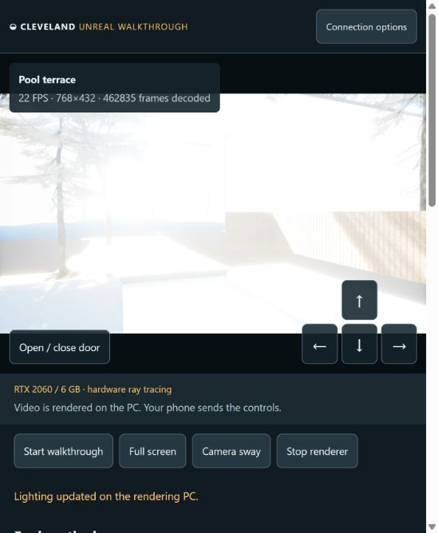
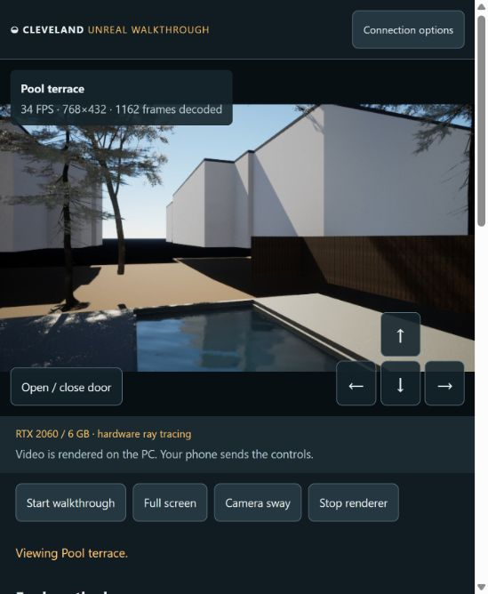

# Lighting v2 review — September 8, 2026

These are unedited screenshots of Chrome decoding the native Unreal video over
the existing Tailscale HTTPS link. All use the saved RTX 2060 More FPS profile:
768×432 output, 50% internal resolution, −0.5-stop exposure compensation.

## Matched 11 AM pool view

September 8, 2026 at 11:00 AM in Washington, DC (UTC 1788879600). Native camera
anchor: x −80 cm, y −1700 cm, capsule center z −71.85 cm, yaw −160°.
The solar elevation remains 46.134°, azimuth 131.417°, and estimated direct
normal illuminance 90,585.6 lux in both versions.

| Previous version | Lighting v2 |
| --- | --- |
|  |  |

In the same unobstructed video rectangle, **62.832% → 0%** of pixels are near
white (all RGB channels ≥250). The rectangle excludes the dashboard and touch
buttons. This measures displayed clipping, not calibrated illuminance or
photographic accuracy. Exact region, hashes and results: [comparison.json](comparison.json).

Reproduce the measurement with `pip install -r requirements-review.txt` and
`python pipeline/measure_lighting_review.py` from the repository root.

## Additional visual checks

| View | Observation | Capture |
| --- | --- | --- |
| Upward sky, September 8 at 11 AM | Blue sky retains its gradient and tree silhouettes; 39 FPS in this capture. | [Sky](after-sky-11am.png) |
| Living room, September 8 at 11 AM | Walls, furniture and windows remain readable after returning indoors; 24 FPS. | [Living room](after-living-11am.png) |
| Kitchen, September 8 at 11 AM | Cabinets, sink and sunlit surfaces retain visible detail; 24 FPS. | [Kitchen](after-kitchen-11am.png) |
| Pool, June 21 at noon | Brighter summer sun retains water/reflections and sky; about 34 FPS. | [Summer noon](after-pool-summer-noon.png) |

[The previous living-room image](before-living-11am.png) is a qualitative
reference with slightly different yaw; it is not used in the matched pixel
measurement. These frame-rate observations are snapshots, not a benchmark.

The packaged renderer reports `lightingVersion: 2`, `extendedExposureRange: true`,
and EV bounds −4 to 20. Its startup log confirms
`r.EyeAdaptation.CachedLightingPreExposure:8`. The lighting-cache clipping warning
seen in the intermediate build is absent in the reviewed final outdoor views.
Native executable SHA-256:
`1f723a7120a41be238ac395cfaf33a462d9a61923e148cbe1a4b1f866cc4e53f`.

Quick sequential date/time edits and room changes were applied through Chrome;
the renderer returned the exact requested 11 AM UTC time. Native game compilation,
packaging, dashboard access/origin tests and the live streaming smoke check passed.
Shutdown now waits for this game's bootstrapper/renderer to exit before replacing
the executable, verified during the update.

Scope: this checks the reported exposure failure and representative indoor/outdoor
views. It does not validate all rooms, all dates, walking paths, source-photo
matching, the 5090, or Cloudflare media relay. Neighbor models and the distant
environment remain visibly approximate and require a separate geometry/material
pass. The original scene, site and earlier downloadable release are preserved.
